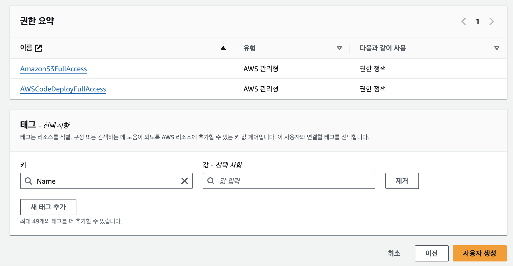
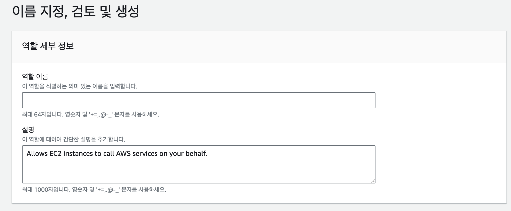

## Github Actions를 이용해 CI/CD 자동배포 적용해보기

> 참고 서적 : 스프링 부트와 AWS로 혼자 구현하는 웹 서비스 (이동욱 지음) <br/>
참고 강의 : https://youtu.be/UF2Giz9PE-E?si=2ByNHJHLDZTeJ7Lq

<br/>

앞서 프로젝트를 생성, 깃헙 원격 저장소로 푸시, ec2인스턴스 생성을 완료했다고 가정한다.

## GithubActions WorkFlow에 deploy.yml 파일 생성

```yaml
name: Build and Deploy to EC2

on:
  push:
    branches: [ "master" ]

jobs:
  deploy:
    runs-on: ubuntu-latest
    steps:
      - uses: actions/checkout@v2
      
      - name: Set up JDK 11
        uses: actions/setup-java@v1
        with:
          java-version: 11

      - name: Grant execute permission for gradlew
        run: chmod +x ./gradlew
        shell: bash

      - name: Build With Gradle
        run: ./gradlew build
        shell: bash
```

여기서는 `master` 브랜치로 코드가 push 될 때 최신 우분투 환경에서 깃헙 액션을 실행시킨다. 
java 11 버전을 사용한 프로젝트를 배포할 것이므로 자바 버전을 11로 지정, 프로젝트의 gradlew에 실행권한을 부여 및 빌드를 수행한다.
- `name` : 액션의 이름을 설정
- `on.push.branches` : 지정한 브랜치에 코드가 push 될 때 설정한 액션을 실행시킨다.
- `jobs.deploy.runs-on` : 액션을 실행시키는 Runner의 운영체제를 지정한다.
- `jobs.build.steps` : 액션의 실제 내용을 작성하는 곳으로서 단계별로 name과 수행동작을 적는다.

작성한 yml 파일을 커밋하고 푸시하게 되면 깃허브 레포지토리의 Actions 탭에서 WorkFlow가 동작하는 모습을 확인할 수 있다.

## S3 생성

AWS의 S3는 일종의 파일 서버이다. 순수하게 파일들을 저장하고 접근 권한을 관리, 검색 등을 지원하는 파일 서버의 역할을 한다.

보통 게시글을 쓸 때 나오는 첨부파일 등록을 구현할 때 많이 이용한다.

Github Actions 스크립트 코드로 빌드된 파일을 저장하도록 구성하고 저장된 파일을 CodeDeploy에서 배포파일로 사용하도록 구성하게 된다.

### 버킷 생성

AWS 홈페이지의 S3의 버킷만들기 버튼을 눌러 이동한다. **리전**을 설정하고 **버킷 이름**을 설정해준다.

<br/>


해당 버킷의 퍼블릭 액세스 차단 설정을 확인해준다. 기본적으로 차단으로 체크되어 있다.

실제 서비스에서 진행할 때는 Jar 파일이 Public일 경우 누구나 내려받을 수 있어 코드나 설정값, 주요 키 값들의 탈취 가능성이 농후하다.

Public으로 설정하지 않더라도 우리는 IAM 사용자를 설정해 발급받을 키를 사용해 접근이 가능하다.

## IAM 사용자 생성

AWS의 CodeDeploy를 사용하기 전에 EC2가 Code Deploy를 연동 받을 수 있게 IAM 역할을 생성한다.


IAM의 사용자 추가로 들어가 사용자 이름을 작성한다.

<br/>


직접 정책 연결을 선택해 연결할 권한을 직접 지정한다.

<br/>


**AmazonS3FullAccess**와 **AWSCodeDeployFullAccess** 권한 총 2개를 추가한다.

<br/>


추가된 권한들을 확인하고 태그명을 Name을 사용하고 본인이 인지 가능한 정도의 이름으로 값을 지정한다.

사용자 생성 버튼으로 생성을 완료한다.

<br/>

### IAM 액세스키와 비밀 액세스키 발급받기


생성한 사용자로 들어가 ‘액세스 키 만들기’버튼을 선택한다.

<br/>


‘AWS 외부에서 실행되는 애플리케이션’ 옵션을 선택한다.

<br/>


액세스키 만들기 버튼을 통해 액세스키를 발급받는다.

<br/>


발급이 완료되면 액세스 키와 비밀 액세스 키를 발급 받게 되고 이 페이지에서 나가게 되면 비밀 액세스키를 확인할 수 없게 되므로 따로 저장을 해두거나 .csv 파일 다운받아 관리한다.

<br/>

## Github Secrets에 액세스 키 저장

Github 저장소의 Settings로 들어가 Secrets and variables 탭의 Actions 탭으로 들어간다.


New repository secret 버튼을 눌러 AWS_ACCESS_KEY_ID, AWS_PRIVATE_ACCESS_KEY 이름으로 각각의 값을 저장해준다. (다른 이름으로 선택 가능)

<br/>

## EC2에 S3, CodeDeploy에 접근할 권한을 부여할 IAM 역할 생성

EC2 인스턴스가 S3, CodeDeploy에 접근해 배포할 파일을 받아오기 위한 권한을 부여할 IAM 역할을 생성해야 한다.


엔터티 유형으로 AWS 서비스, 사용사례로 EC2를 지정한다.

<br/>


권한으로 AmazonS3FullAccess, AWSCodeDeployFullAccess 권한을 추가해준다.

<br/>


마지막으로 역할 이름을 지정해 역할 생성을 완료한다.

<br/>

### EC2에 역할 적용


EC2 페이지로 들어가 인스턴스를 선택해 보안 → IAM 역할 수정 버튼을 선택한다.

<br/>


전에 생성한 IAM 역할 이름을 선택해 IAM 역할을 업데이트한다.

<br/>

## EC2 세팅

1. Java 설치 (openjdk11 혹은 aws corretto), 자바 버전 확인
2. ruby 설치
3. 서울리전의 CodeDeploy 리소스 파일 다운로드
4. 설치 파일에 실행 권한 부여
5. 에이전트 설치
6. 에이전트 status 확인f

<br/>

```bash
# wget 설치
$ sudo yum install wget

# JAVA 설치
$ sudo wget https://corretto.aws/downloads/latest/amazon-corretto-11-x64-linux-jdk.rpm -0 java11.rpm

# jdk11 설치
$ sudo yum localinstall jdk11.rpm

# java 버전 확인
$ java --version

# ruby 설치
$ sudo yum install ruby

# 서울 리전의 CodeDeploy 설치 파일 다운로드
$ cd /home/ec2-user
$ sudo wget https://aws-codedeploy-ap-northeast-2.s3.ap-northeast-2.amazonaws.com/latest/install

# 설치파일에 실행 권한 부여
$ sudo chmod +x ./install

# CodeDeploy 에이전트 설치
$ sudo ./install auto

# CodeDeploy 에이전트 실행 상태 확인
$ sudo service codedeploy-agent status
```

1. **wget** 패키지가 설치되어 있지 않을 경우 설치한다.
2. 원하는 자바 버전을 설치해준다. aws에 최적화된 corretto 혹은 openjdk11버전을 설치한다. (프로젝트의 자바 버전이 다를 경우 그 버전의 자바 설치)
   설치가 완료되면 설치된 자바의 버전을 확인해준다.
3. ruby 패키지를 설치한다.
4. `/home/ec2-user`경로로 이동하고 해당 경로에 CodeDeploy 에이전트 설치 파일을 다운받는다. (리전을 서울로 설정)
   (/home/ec2-user 경로는 EC2 인스턴스를 리눅스 OS로 설정했을시 기본적으로 생성되는 경로이다.)
5. 다운받은 설치파일에 chmod 명령어를 사용하여 실행 권한을 부여한다.
6. CodeDeploy 에이전트 설치를 진행한다.
7. 설치가 완료되면 status를 확인해 설치가 되었는지 확인한다.

## CodeDeploy를 위한 IAM 역할 생성


사용사례를 CodeDeploy로 설정해 역할 생성을 시작한다.

<br/>


AWSCodeDeployRole 권한을 추가 및 역할의 이름을 생성해 역할 생성을 마무리한다.

<br/>

## CodeDeploy 애플리케이션 생성


컴퓨팅 플랫폼을 **EC2/온프레미스**로 설정하고 애플리케이션을 생성한다.

<br/>


생성한 애플리케이션 내에 배포 그룹을 생성한다.

<br/>


배포 그룹 이름을 지정하고 서비스 역할로 전에 생성한 CodeDeploy용 IAM 역할 이름을 지정해준다.

<br/>


애플리케이션 배포 방법으로 현재 위치, 환경 구성으로 Amazon EC2 인스턴스를 선택한다.
환경구성의 키로 Name, 값으로 EC2 인스턴스를 선택해준다.

<br/>


배포 설정으로 CodeDeployDefault.AllAtOnce 선택 및 로드 밸런싱 활성화를 선택 해제해준다.

<br/>

## 설정 코드 작성 (deploy.yml 수정)

처음에 만들었던 deploy.yml 파일의 코드를 수정해준다.

```yaml
name: Build and Deploy to EC2

on:
  push:
    branches: [ "master" ]

# -------- 추가 ---------
env:
  PROJECT_NAME: 버킷에 저장할 프로젝트 이름
  BUCKET_NAME: S3 생성시 설정한 이름
  CODE_DEPLOY_APP_NAME: CodeDeploy 애플리케이션 이름
  DEPLOYMENT_GROUP_NAME: CodeDeploy 배포 그룹 이름

jobs:
  deploy:
    runs-on: ubuntu-latest
    steps:
      - uses: actions/checkout@v2
      
      ...
			
			# -------- 추가 ---------
      - name: Make Zip File
        run: zip -qq -r ./$GITHUB_SHA.zip .
        shell: bash

      - name: Configure AWS credentials
        uses: aws-actions/configure-aws-credentials@v1
        with:
          aws-access-key-id: ${{ secrets.AWS_ACCESS_KEY_ID }}
          aws-secret-access-key: ${{ secrets.AWS_PRIVATE_ACCESS_KEY }}
          aws-region: ap-northeast-2

      - name: Upload to S3
        run: aws s3 cp --region ap-northeast-2 ./$GITHUB_SHA.zip s3://$BUCKET_NAME/$PROJECT_NAME/$GITHUB_SHA.zip

      - name: Code Deploy
        run: aws deploy create-deployment --application-name $CODE_DEPLOY_APP_NAME --deployment-config-name CodeDeployDefault.OneAtATime --deployment-group-name $DEPLOYMENT_GROUP_NAME --s3-location bucket=$BUCKET_NAME,bundleType=zip,key=$PROJECT_NAME/$GITHUB_SHA.zip
```

- `env` : 환경변수를 설정해서 사용한다.
- `aws s3 cp` : S3로 파일을 업로드하는 동작을 설정한다.
- `aws-access-key-id`, `aws-secret-access-key` : 깃헙 레포지토리 설정에서 시크릿값을 저장해둔 액세스키의 이름을 각각 지정한다.
- `aws deploy` : CodeDeploy에 배포단위를 생성한다.

`deploy.yml` 파일을 커밋후 push해 깃헙 액션에서 제대로 수행되는지 확인한다. 이제 깃헙 저장소의 프로젝트를 zip 파일로 생성하고 생성된 zip 파일을 S3 저장소로 이동시키고 CodeDeploy에게 전달하게 된다.

## CodeDeploy용 액션 파일 appspec.yml 파일 작성

CodeDeploy의 동작을 설정할 `appspec.yml` 파일을 작성한다.
(`deploy.yml`은 파일의 이름을 임의로 지정해도 됬지만 appspec.yml은 정확한 파일 이름을 사용해야 한다.)

EC2 서버에서 설치해둔 CodeDeploy agent가 S3저장소의 파일을 다운받고 해당 파일내의 scripts 폴더의 `deploy.sh` 배포 스크립트 파일을 실행시킨다.

```yaml
version: 0.0
os: linux

files:
  - source: /
    destination: /home/ec2-user/DeployProject
permissions:
  - object: /home/ec2-user/DeployProject/
    owner: ec2-user
    group: ec2-user
hooks:
  AfterInstall:
    - location: scripts/deploy.sh
      timeout: 60
      runas: ec2-user
```

- `files.source` : CodeDeploy agent가 다운로드 받은 코드에서 어느 경로를 다운받을지 결정한다.
  (”/”는 전체파일을 다운받는다.)
- `file.destination` : ec2 서버에서 어느 경로에 다운받을지 결정한다.
- `hooks.AfterInstall` : CodeDeploy의 수면주기 중 AfterInstall이 발생 시 코드에서 scripts 폴더 안의 배포용 스크립트 파일 deploy.sh을 실행시킨다.

## 배포용 스크립트 파일 deploy.sh 생성

```bash
#!/usr/bin/env bash

REPOSITORY=/home/ec2-user/DeployProject
cd $REPOSITORY

APP_NAME=DeployProject
JAR_NAME=$(ls $REPOSITORY/build/libs/ | grep 'SNAPSHOT.jar' | tail -n 1)
JAR_PATH=$REPOSITORY/build/libs/$JAR_NAME

CURRENT_PID=$(pgrep -f $APP_NAME)

if [ -z $CURRENT_PID ]
then
  echo "> 종료할것 없음."
else
  echo "> kill -9 $CURRENT_PID"
  kill -15 $CURRENT_PID
  sleep 5
fi

echo "> $JAR_PATH 배포"
nohup java -jar $JAR_PATH > /dev/null 2> /dev/null < /dev/null &
```

요약 : JAR 파일이 이미 실행되고 있는 상태라면 해당 프로세스를 kill하고 새로운 버전의 프로세스를 실행시킨다.

- `REPOSITORY` : appspec.yml 에서 `/home/ec2-user` 경로에 DeployProject 이름으로 프로젝트를 저장했으므로 DeployProject 이름을 지정한다. 해당 프로젝트로 이동한다.
- `JAR_NAME` : 깃허브 액션에서 프로젝트를 빌드하고 빌드 파일을 S3 저장소로 전송 후 CodeDeploy로 전달했기 때문에 프로젝트의 build/libs 폴더에는 빌드된 결과물 `~.SNAPSHOT.jar` 이름의 jar 파일이 존재한다. 따라서 해당 파일 이름을 환경변수로 저장해둔다.
- `JAR_PATH` : 빌드된 결과물의 전체 경로 (프로젝트의 경로(REPOSIOTRY)/build/libs/빌드결과물이름(JAR_NAME) )를 지정한다.
- `CURRENT_PID` : pgrep -f 명령어를 이용해 APP_NAME에 해당하는 프로세스의 PID를 가져와 저장해둔다.
- `if ~ else ~ fi` : 만약 `CURRENT_PID` 변수에 내용이 없다면 (즉 프로세스가 실행되고 있지 않다면) “> 종료할것 없음” 문자열을 출력하고 종료한다.
  반대로 `CURRENT_PID` 변수에 내용이 있다면 (즉 프로세스가 실행중이라면) 해당 프로세스의 PID 번호(CURRENT_PID)로 프로세스를 kill하고 다음 명령어로 넘어간다.
- `nohup java -jar` : 빌드된 결과물 경로(JAR_PATH)를 사용해서 백그라운드로 프로젝트를 실행시킨다.

커밋후 push 한 후 배포가 됬는지 확인 후 ec2 인스턴스의 `퍼블릭 주소:8080` 로 접속해 프로젝트가 잘 실행되는지 확인한다.

## 결과

이후에 코드를 변경하고 깃헙 레포지토리로 push를 하게 되면 아래의 과정을 수행하게 된다.

1. 위의 깃헙 액션(deploy.yml) 수행
2. zip 파일 생성
3. zip 파일을 S3로 이동
4. CodeDeploy에서 S3의 zip 파일을 다운받아 배포 스크립트 파일 (deploy.sh) 실행
5. 빌드파일을 백그라운드로 실행
